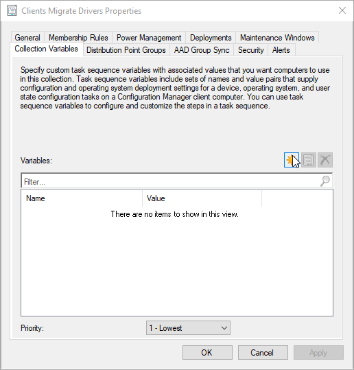
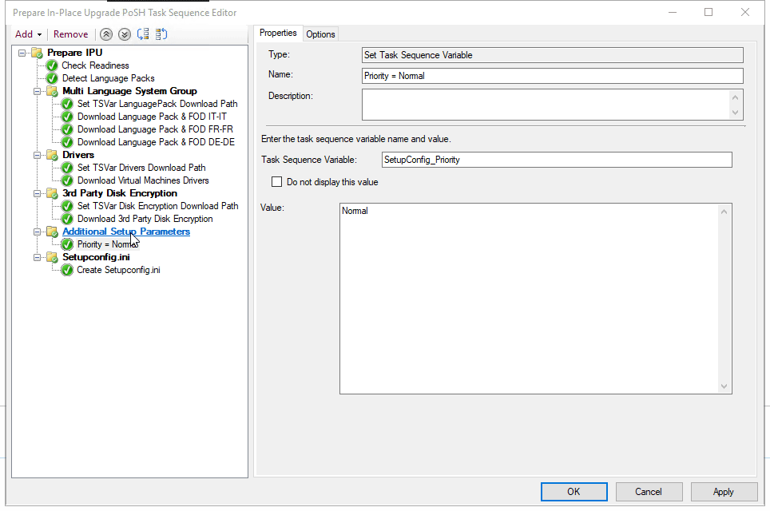

# Prepare Windows 10 In-Place Upgrade Tasksequence

## Introduction

Feature Updates deployed with SCCM/ConfigMgr will just do an In-place Upgrade of Windows 10. Which has a couple of advantages compared to a In-Place Upgrade Tasksequence.

| ​                         | Servicing​                      | Task Sequence​            |
|--------------------------|:------------------------------:|:------------------------:|
| Content Size​             | ESD up to 20% less             | WIM​                      |
| Content Location​         | DP, Cloud DP, Microsoft Update​ | DP, Cloud DP​             |
| User Disruption​          | None, till first Reboot​        | during the whole Process​ |
| User Experience​          | CU Updates / Home Experience​   | unfamiliar​               |
| Reboot behavior         | User driven​                    | forced​                   |
| Admin preparation effort​ | similar to regular Updates​     | high​                     |
| Additional Setup Params​  | [SetupConfig.ini](https://docs.microsoft.com/en-us/windows/deployment/update/feature-update-user-install)            | TS variable                   |
| Troubleshooting​          | simple​                         | complex​                  |
| Failure Sources​          | few​                            | many​                     |
| Modern Management Ready​  | yes​                            | no​                       |

Since SCCM/ConfigMgr managed Clients (SUP) it will not do Dynamic Updates, we can make use of the setupconfig.ini. Setupconfig.ini is honored during the In-Place Upgrade and will pass additional Setup Parameters. Such as **Language Packs** [^LXP], **Drivers**, **Priority**, **3rd Party Disk Encryption**, etc... Basically, all the available [Windows Setup Command-Line options](https://docs.microsoft.com/en-us/windows-hardware/manufacture/desktop/windows-setup-command-line-options "Windows Setup Command-Line Options")

[^LXP]: [LXPs](https://techcommunity.microsoft.com/t5/Windows-IT-Pro-Blog/Local-Experience-Packs-What-are-they-and-when-should-you-use/ba-p/286841 "LXPs") do not need to be pre-staged if the Microsoft Store can update apps. Therefore installed LXPs will automatically migrated.

## Process (simplified)

1. Pre-stage content locally. Such as drivers and language packs.
2. Create setupconfig.ini that has additional setup parameters.
3. Deploy Feature update like any other update You would deploy with SCCM/ConfigMgr.

## Prepare Tasksequence

To automate step 1 and 2, we can use a Tasksequence that does all that for us.
[New-PrepareIPUTaskSequence.ps1](./New-PrepareIPUTaskSequence.ps1) will create a template Tasksequence, which You can modify to your liking.

## Configuration

### Create Template

Run this in your **test environment**!!!

Open SCCM Console and connect via PowerShell ISE.

Paste content of [New-PrepareIPUTaskSequence.ps1](./New-PrepareIPUTaskSequence.ps1) below where ist says: Set-Location "$($SiteCode):\" @initParams

Make sure you run the code with a user that has the proper role to create packages and Tasksequences. The code will create a dummy package and a temp folder in c:\temp used as package source. The package can/should be deleted right after the code completed. After a few minutes you will have a new Tasksequence called "Template Prepare In-Place Upgrade" which you can copy to your production environment.

### Modify Tasksequence Template

#### Download Content Steps

* Create language packages and assign them to the download content step, if required
* Create Drivers packages for drivers that are required for the upgrade and can't be deployed to the current OS, change the condition to match your models and manufacturer

#### Additional Setup Parameters

|  ||
|:-------------------------------------------------------------:|:-------------------------------------------------------------:|
| via Collection Variable                                       | via Tasksequence Step |

The Tasksequence is designed to pre-stage content and create the setupconfig.ini. You can add Additional Setup Parameters using Tasksequence Variables. Make sure you use the prefix **SetupConfig_**

E.g. SetupConfig_BitLocker = ForceKeepActive. This would add a line to setupconfig.ini ->  BitLocker=ForceKeepActive

These Tasksequence Variables can be set within the Tasksequence or as Collection Variables.

### Helper Collections

Run this in your **test environment**!!!

[New-PrePareIPUHelperCollections.sp1](./New-PrePareIPUHelperCollections.sp1) will create Helper Collection for the deployment. Collection 2. and 4. need to be modified, once you created the deployment for the Feature Update. Only then you have a DeploymentID that needs to be added to the query in these collections. Replace CHANGEMEHERE with the DeploymentID.

## Deployment

The Prepare In-Place Upgrade Tasksequence is meant to be deployed as required without showing the progress, prior to the in-place upgrade. You can use **1. Prepare Win10 IPU** to deploy the Prepare Tasksequence and **3. Deploy Win10 IPU** to deploy the actual Feature Update.

To find the deployment id, you have to enable the column deploymentid on your collections deployment tab. Use this Deployment id to change the query for Collection 2. and 4.

## TODO

- [x] LXP instead of LP documentation
- [x] How to configure the deployment
- [x] SetupConfig_ Variables explanation in the Readme
- [x] How to get DeploymentID documentation
- [ ] Collections or Reporting for most common issues, such as free space, canceled by user (maxruntime)

## Contributing

Please do. Pull requests are welcome.
